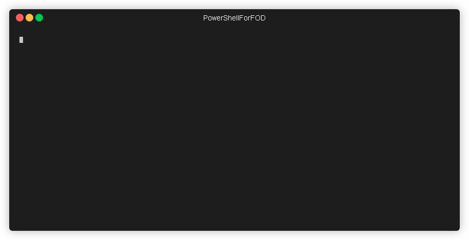
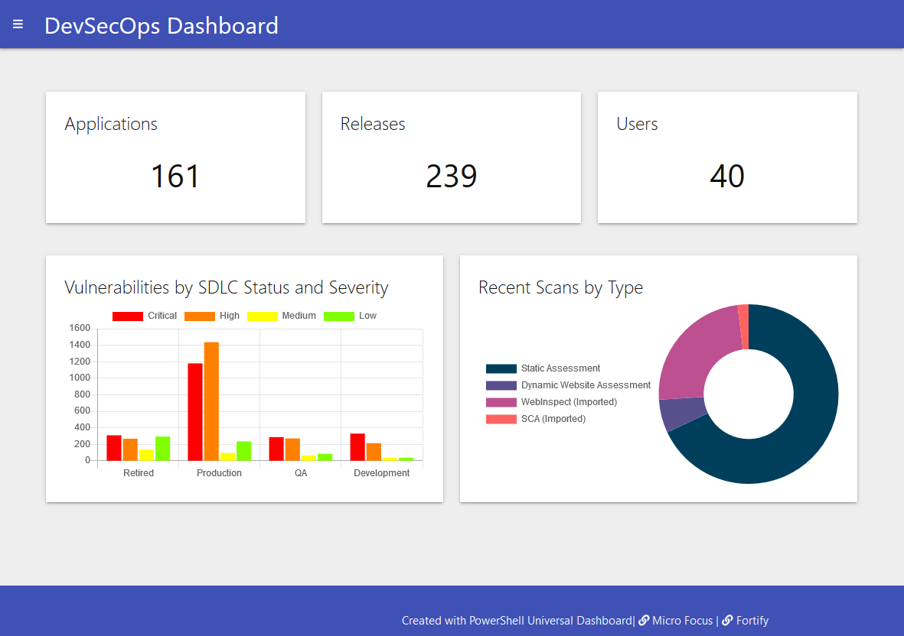

[](https://ci.appveyor.com/project/akevinlee/powershellforfod)

# Power Shell For Fortify On Demand (FOD) Module

#### Table of Contents

*   [Overview](#overview)
*   [Current API Support](#current-api-support)
*   [Installation](#installation)
*   [Configuration](#configuration)
*   [Example](#example)
*   [Logging](#logging)
*   [Developing and Contributing](#developing-and-contributing)
*   [Licensing](#licensing)

## Overview

This is a [PowerShell](https://microsoft.com/powershell) [module](https://technet.microsoft.com/en-us/library/dd901839.aspx)
that provides command-line interaction and automation for the [Fortify On Demand API](https://api.ams.fortify.com/swagger/ui/index).

 

## Use Cases

Although the module can be used generically, some use cases where it can be applied include:

 * Programatically importing existing users, applications and releases into FOD. Using PowerShell scripting it is possible 
   to create scripts that pull data from other sources - such as a spreadsheet - and execute the functions in this module.
 * Programatically importing on-premise scans executed using [Fortify SCA](https://www.microfocus.com/en-us/products/static-code-analysis-sast)
   or [Fortify WebInspect](https://www.microfocus.com/en-us/products/webinspect-dynamic-analysis-dast).
 * Running Static Scans from third party build tools where a plugin is not currently available.  
 * Programatically creating dashboards from FOD data together with data from other sources.  
 
An example dashboard created with this module and PowerShell [Universal Dashboard](https://universaldashboard.io/) is shown below:

 
        
----------

## Current API Support

At present, this module can:
 * Authenticate against the FOD API to retrieve and store authentication token
 * Execute a generic FOD API REST command with authentication and rate limiting support
 * Query, add, update and remove Users
 * Query, add, update and remove Applications
 * Query, add, update and remove Users
 * Query Attributes
 * Query Application, Release and individual Scans
 * Query, add and remove user access to Applications
 * Query, add and remove user group access to Applications
 * Query Vulnerabilities
 * Import on-premise static scans (from [Fortify SCA](https://www.microfocus.com/en-us/products/static-code-analysis-sast))
 * Import on-premise dynamic scans (from [Fortify WebInspect](https://www.microfocus.com/en-us/products/webinspect-dynamic-analysis-dast))
 * Export and Import Application Audit Templates 

Development is ongoing, with the goal to add broad support for the entire API set.

Please read [Usage](USAGE.md) to see how the module can be used to accomplish some example tasks.
There are also a number of more detailed scripted [Examples](examples).

----------

## Installation

You can get the latest release of the PowerShellForFOD from the [PowerShell Gallery](https://www.powershellgallery.com/packages/PowerShellForFOD)

```PowerShell
Install-Module -Name PowerShellForFOD
```

----------

## Configuration

To access the [Fortify On Demand](https://www.microfocus.com/en-us/products/application-security-testing) API you need 
to create an "authentication" token. This module allows the creation and persistence of this token so that it does not 
need to be passed with each command. To create the token, run the following commands to set your API endpoint, use 
Username/Password authentication and request a token:

```PowerShell
Set-FODConfig -ApiUri https://api.ams.fortify.com -GrantType UsernamePassword -Scope api-tenant
Get-FODToken
```

You will be requested for your login details, in example you would enter your `tenantId\username` and `password`.
For more information on how to authenticate please refer to [USAGE](USAGE.md).

## Example

Example command:

```powershell
Get-FODApplications -Filters "applicationName:test" -Paging | Out-GridView
```

For more example commands, please refer to [USAGE](USAGE.md).


## Supported Versions

PowerShellForFOD has been tested on PowerShell 5.x (Windows) and PowerShell Core 7.x (Linux).
On Windows it should work on any PowerShell version later than 5.x - however if you find any problems
please raise an [issue](https://github.com/fortify-community-plugins/PowerShellForFOD/issues).
----------

## Developing and Contributing

Please see the [Contribution Guide](CONTRIBUTING.md) for information on how to develop and contribute.

If you have any problems, please consult [GitHub Issues](https://github.com/fortify-community-plugins/PowerShellForFOD/issues)
to see if has already been discussed.

----------

## Licensing

PowerShellForFOD is licensed under the [GNU General Public license](LICENSE).

This is community content provided by and for the benefit of [Micro Focus](https://www.microfocus.com/) customers, 
it is not officially endorsed nor supported via [Micro Focus Software Support](https://www.microfocus.com/en-us/support).


